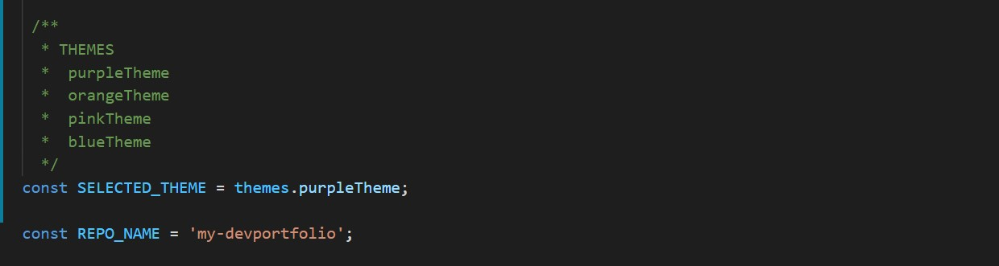

<h1 align="center"> Software Developer Portfolio </h1> 

<p align="center">
  <a href="http://hits.dwyl.com/divyanshu1610/my-devportfolio"></a>
  <a href="https://nodejs.org/en/blog/release/v12.13.0/"></a>
  <a href="https://www.npmjs.com/package/npm/v/6.13.4"></a>
  <a href="https://reactjs.org/"></a>
  <a href="http://badges.mit-license.org/"></a>
</p>

<p align="center"> 
    <a href="https://divyanshu1610.github.io/my-devportfolio/" target="_blank">
    </img>
  </a>
</p>

:star: Star us on GitHub — it helps!

To view a live example, **[click here](https://divyanshu1610.github.io/my-devportfolio/)**

# Clone And Use 📋

- The website is completely built on `react-js` framework of `javascript` and that's why we need `nodejs` and `npm` installed.
- While installing `nodejs` and `npm`, try to install versions which are equal or greater than the versions mentioned in badges above.
- In case you want to help developing it or simply saving it, you can fork the repository just by clicking the button on the top-right corner of this page.
- After the successful installation of `nodejs` and `npm`, clone the repository into your local system using below command:
  - ```python
     git clone https://github.com/divyanshu1610/my-devportfolio.git
    ```
  - This will clone the whole repository in your system.
- To download required dependencies to your system, navigate to the directory where the cloned repository resides and execute following command:
  - ```python
    npm install
    ```
- Now, the project is ready to use.
- You can check it using `npm start`, it will open the website locally on your browser.

# Customize it to make your own portfolio ✏️

In this project, there are basically 2 things that you need to change to customize this to anyone else's portfolio: 
1. **package.json**
2. **Personal Information**

### package.json

Open this file, which is in the main cloned directory, choose any "name" and change "homepage " to `https://<your-github-username>.github.io/<your-repository-name>`.<br>
Do not forget the `https://`, otherwise fonts will not load.

### Personal Information

You will find `src/data/userData.js` file which contains the complete information about the user. The file looks something like below:

```
// ----- Landing Page ----- //
const LANDING_DATA = {
    ...
}

// ----- Experience ------ //
const EXPERIENCE_DATA = {
    ...
}

...
```

You can change the personal information, experience, education, projects, certifications, contact information etc. in `src/data/userData.js` to directly reflect them in portfolio website.


# Choose Theme 🌈

- You can take a look at bottom of `src/data/userData.js` file where all available themes are mentioned.
- At the bottom of this file you will see the below code:

  
- That's it. You just need to change the theme name and the code will take care of everything else.

- Set the 'REPO_NAME' to the your repository name in which project will be deployed. See **Deployment** section.

  Run `npm start` to check if everything is ok.


# Deployment 📦

- Once you are done with your setup and have successfully completed all steps above, you need to put your website online!
- I recommend using [Github Pages](https://create-react-app.dev/docs/deployment/#github-pages) to achieve this the EASIEST WAY.

- Create a repository in github.
> Note : REPO_NAME should match the repository name in which project will reside.

- Add the repository as your remote.

- Run `npm run deploy` to build and create a branch called `gh-pages`. It will push the `build` files to that branch.

Now, your website is successfully deployed and you can visit it at `<your-github-username>.github.io/<your-repository-name>`.  
If you are stuck somewhere and want to observe the deployment process in depth, refer any deployment guides on YouTube. 
  

# License 📄

This project is licensed under the MIT License - see the [LICENSE.md](./LICENSE) file for details.

# References 👏🏻


- Some Design and Implementation Ideas are taken from [Master Portfolio Project](https://github.com/ashutosh1919/masterPortfolio) and [Dev Portfolio](https://github.com/RyanFitzgerald/devportfolio)
